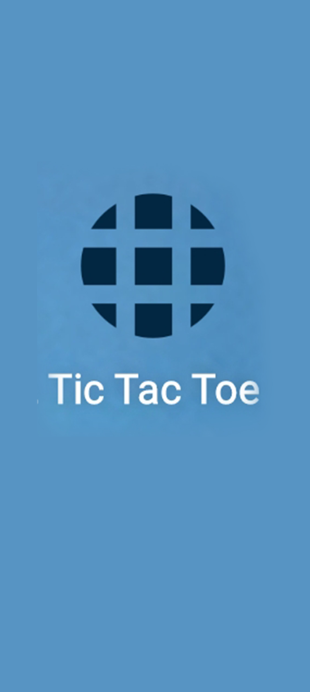
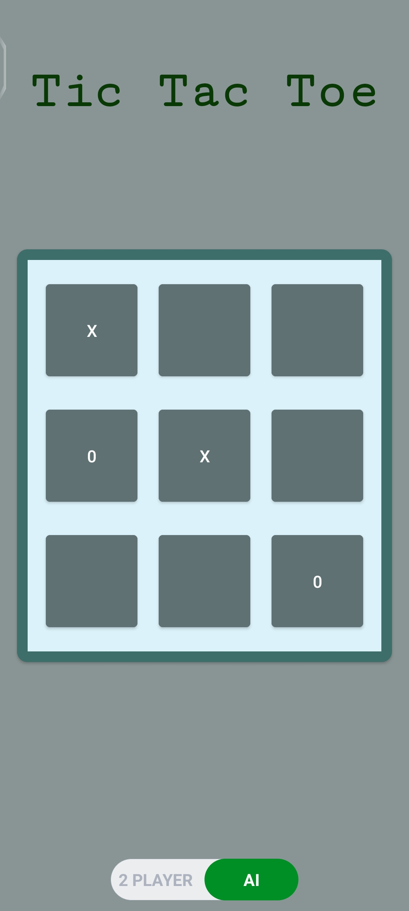

# TIC TAC TOE GAME - An Awesome Android Game 🤩🎮🎲

An awesome Android Game build with min-max algorithm and kotlin 🤩🎮🎲

## Preview - Tic TAC Toe 🌟

# images 🤗

<table >
  <tr>
    <td></td> 
    <td></td> 
    <td></td> 
 
  </tr>
</table>

## About

The Tic Tac Toe game implemented in Kotlin with XML interface features both Minimax AI and two-player modes. In Minimax mode, the AI employs the algorithm to make optimal moves, ensuring a challenging single-player experience. Simultaneously, two players can compete against each other, strategizing to outmaneuver their opponent. The XML interface provides a user-friendly display for seamless gameplay. This versatile implementation offers both competitive and solo gaming experiences, making it enjoyable for players seeking varied challenges in the classic Tic Tac Toe game
